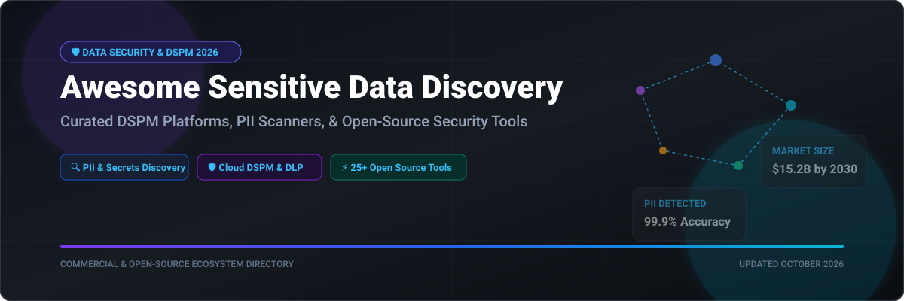

# Awesome-Data-Security-Sensitive-Data-Discovery 🔍 🛡️

  

  
  
  
  
  
  

---

## 🌟 Top Data Security & Sensitive Data Discovery Ecosystem

**Curated List of Commercial DSPM Platforms & Open-Source Data Discovery Tools**  
*Focused on PII Detection, Data Classification, DSPM, Data Lineage, Access Governance & Self-Hosted Data Security Scanning*

**Last updated: October 2026** 📅

---

### 📌 Overview & SEO Summary

Welcome to the ultimate curated directory of **data security posture management (DSPM) platforms**, **open-source sensitive data discovery tools**, and **data classification frameworks**. Whether you are looking for enterprise-grade commercial solutions (such as *Amazon Macie*, *BigID*, and *Varonis*), or self-hostable open-source alternatives (like *Presidio*, *TruffleHog*, and *Nightfall*), this list covers category leaders, PII detection, and privacy-respecting data governance.

**Key Market Context:**
- **Microsoft Presidio** is the **leading open-source PII detection and anonymization framework**, with **5K+ GitHub stars** and **support for 50+ languages**.
- **TruffleHog** has **25K+ GitHub stars** and detects **800+ types of secrets**, credentials, and PII across **Git repositories, S3 buckets, and filesystems**.
- **Gitleaks** provides **fast secret detection in Git repositories** with **custom rules and 200+ built-in patterns**.

---

## 📑 Table of Contents

- [🏢 SaaS & Commercial Platforms](#-saas--commercial-platforms)
- [🔓 Open-Source GitHub Projects](#-open-source-github-projects)
- [🛠️ How to Contribute](#%EF%B8%8F-how-to-contribute)
- [📊 Star History](#-star-history)
- [🤝 Support & Sponsorship](#-support--sponsorship)
- [⚠️ Disclaimer](#%EF%B8%8F-disclaimer)

---

## 🏢 SaaS / Commercial Platforms

> 📈 **Market Analysis & Overview**: The Data Security Posture Management (DSPM) and Sensitive Data Discovery market is estimated at **$3.2 Billion in 2026** and projected to reach **$15.2 Billion by 2030 (CAGR: ~36%)**. The sector is currently **moderately fragmented**, undergoing rapid consolidation where hyperscalers (Microsoft, AWS) offer native foundational coverage while specialized DSPM startups (Cyera, BigID, Securiti) capture high-complexity enterprise multi-cloud workloads.

| SaaS / Commercial Platform | Company / Owner | Valuation / Market Cap | Standard Edition Starting Price | Free Tier / Free Trial Limits | Description |
| :--- | :--- | :--- | :--- | :--- | :--- |
| **[Microsoft Purview Information Protection](https://www.microsoft.com/en-us/security/business/microsoft-purview)** 🔷 | Microsoft | ~$3.90 Trillion | **$5.00 / user / month** (Purview Information Protection Plan 1) | **30-day free trial** (up to 25 licenses for M365 E5 compliance trial) | **Microsoft-native data governance** — **Sensitive data discovery, classification, and labeling** across M365 & Azure 🏷️. |
| **[Amazon Macie](https://aws.amazon.com/macie/)** ☁️ | Amazon | ~$2.00 Trillion | **$0.10 / GB** (sensitive data discovery); **$1.00 / GB** (S3 inventory evaluation) | **30-day free trial** (includes automated bucket evaluation & 1 GB data discovery) | **AWS-native data security** — **Machine learning and pattern matching** to discover sensitive data in S3 🔍. |
| **[Varonis Data Security Platform](https://www.varonis.com/)** 🔵 | Varonis | ~$5.20 Billion | **$25.00 / user / month** (Starting SaaS subscription package) | **30-day free trial** (includes Data Risk Assessment with full scan) | **Data security platform** — **Data discovery, classification, and access governance** with automated threat detection 🛡️. |
| **[Cyera](https://www.cyera.com/)** 🌊 | Cyera | ~$3.00 Billion | **$1,500.00 / month** (Base cloud workspace starter tier) | **14-day proof-of-concept trial** (scans up to 10 TB of cloud data) | **AI-powered DSPM** — **Data discovery, classification, and risk assessment** across AWS, Azure, GCP & SaaS ⚡. |
| **[BigID](https://bigid.com/)** 🎯 | BigID | ~$1.25 Billion | **$2,500.00 / month** (Starting enterprise module subscription) | **14-day interactive demo trial** (pre-configured environment with sample data scan) | **Data intelligence platform** — **DSPM, data catalog, and privacy compliance** with 100+ classifiers 📊. |
| **[OneTrust DataDiscovery](https://www.onetrust.com/)** 🏢 | OneTrust | ~$4.50 Billion (Private valuation) | **$500.00 / month** (Starting privacy & data mapping module) | **14-day free trial** (access to data mapping & discovery assessment) | **Privacy management platform** — **Automated data mapping** for GDPR and CCPA compliance 🏛️. |
| **[Securiti.ai](https://securiti.ai/)** 🟣 | Securiti | ~$1.00 Billion (Private valuation) | **$1,000.00 / month** (Data Command Center base license) | **30-day free trial** (scans up to 5 cloud data sources) | **Data command center** — **DSPM, privacy, and governance** in one unified AI platform 🤖. |
| **[Normalyze](https://normalyze.ai/)** 🎯 | Normalyze (Qualys) | ~$350.00 Million | **$800.00 / month** (Cloud data security posture module) | **14-day free trial** (scans 1 cloud account up to 2 TB) | **DSPM platform** — **Agentless data discovery and classification** across cloud and SaaS 🎯. |
| **[Open Raven](https://www.openraven.com/)** 🦅 | Open Raven | ~$150.00 Million | **$500.00 / month** (Developer / Community Cloud edition) | **30-day free trial** (scans 1 AWS account up to 1 TB) | **Cloud-native data security** — **Agentless data discovery and classification** for AWS, Azure, and GCP 🦅. |
| **[Symmetry Systems](https://www.symmetry-systems.com/)** 🔄 | Symmetry Systems | ~$100.00 Million | **$600.00 / month** (DataGuard starter tier) | **14-day free trial** (scans 1 cloud organization unit) | **Data security posture management** — **Unified data and identity security** with data access graph 🔄. |

---

## 🔓 Open-Source GitHub Projects

*Sorted by GitHub_Stars_Count (Descending)* 🌟

- **[TruffleHog](https://github.com/trufflesecurity/trufflehog)**   
  **Find, verify, and analyze leaked credentials**, AGPL-3.0 licensed. **25K+ GitHub stars** — **the most popular open-source secret detection tool** . **800+ types of secrets, credentials, and PII** detected . **Scans Git repositories, S3 buckets, filesystems, and CI/CD pipelines** . **Verification** — confirms if credentials are live before alerting . **Custom detectors** for organization-specific patterns . **The definitive open-source sensitive data detection tool** . 🔍

- **[Gitleaks](https://github.com/gitleaks/gitleaks)**   
  **Detect and prevent hardcoded secrets**, MIT licensed. **20K+ GitHub stars** — **the fastest secret detection in Git repositories** . **200+ built-in patterns** for API keys, tokens, passwords, and credentials . **Custom rules** via TOML configuration . **Pre-commit hooks** for prevention . **The most widely used open-source secret scanner in CI/CD** . 🛡️

- **[Microsoft Presidio](https://github.com/microsoft/presidio)**   
  **Context aware, pluggable and customizable data protection and de-identification SDK**, MIT licensed. **5K+ GitHub stars** — **the leading open-source PII detection and anonymization framework** . **50+ languages supported** including English, Spanish, French, German, and Chinese . **PII detection** — names, addresses, credit cards, SSNs, phone numbers, emails, and more . **Anonymization** — redaction, masking, hashing, and encryption . **Pluggable architecture** for custom recognizers . **The standard for open-source PII detection** . 🎯

- **[Detect Secrets](https://github.com/Yelp/detect-secrets)**   
  **An enterprise friendly way of detecting and preventing secrets in code**, Apache-2.0 licensed. **From Yelp** — **the original open-source secret detection tool** . **Plugin-based architecture** for custom detectors . **Baseline management** for gradual adoption . **Used by thousands of organizations** for pre-commit secret scanning . 🔐

- **[DataDog Agent (Sensitive Data Scanner)](https://github.com/DataDog/datadog-agent)**   
  **Datadog Agent with sensitive data scanning integrations**, Apache-2.0 licensed. **Scans logs and traces for sensitive data** before ingestion . **Custom scanning rules** for PII, credentials, and tokens . **The most widely deployed open-source observability agent with data scanning** . 🐶

- **[Gretel Synthetics](https://github.com/gretelai/gretel-synthetics)**   
  **Generate synthetic data with differential privacy**, Apache-2.0 licensed. **Privacy-preserving synthetic data generation** . **Differential privacy guarantees** . **The standard for generating privacy-safe datasets** — relevant for sensitive data discovery testing . 🧪

- **[Data Profiler](https://github.com/capitalone/DataProfiler)**   
  **What's in your data? Detect schema, statistics, entities, and more**, Apache-2.0 licensed. **From Capital One** — **automated data profiling and sensitive data detection** . **Identifies PII, financial data, and custom entities** . **Statistical profiling** for data quality assessment . **The most comprehensive open-source data profiling library** . 📊

- **[Scrubadub](https://github.com/LeapBeyond/scrubadub)**   
  **Clean personally identifiable information (PII) from free text**, MIT licensed. **Python package to redact PII** such as names, email addresses, phone numbers, and SSNs from text documents . **Extensible detectors & filers** for custom data masking . 🧼

- **[Nightfall Python SDK](https://github.com/nightfallai/nightfall-python-sdk)**   
  **Python SDK for sensitive data detection**, MIT licensed. **Detects PII, PHI, PCI, and custom data types** . **ML-based detection** for names, addresses, and context-aware patterns . **Integrates with cloud storage, databases, and APIs** . **The most accessible SDK for sensitive data detection** . 🌙

- **[Phileas](https://github.com/philterd/phileas)**   
  **Java-based PII detection and redaction library**, Apache-2.0 licensed. **Detects and redacts PII** from text and documents . **Supports custom filters and policies** . **The most complete Java PII library** . ☕

- **[PII-Codex](https://github.com/areed1192/pii-codex)**   
  **PII detection, classification and severity assessment toolkit**, MIT licensed. **Combines Microsoft Presidio with custom recognizers** . **Multi-language PII detection** and risk severity scores . 🎯

- **[OpenDLP](https://github.com/OpenDLP/OpenDLP)**   
  **Open-source data loss prevention and sensitive data discovery**, GPL-3.0 licensed. **Scans structured and unstructured data** for credit cards, SSNs, and PII . **Agent-based and agentless scanning** . **The original open-source DLP tool** . 🏛️

---

## 🛠️ How to Contribute

Contributions are welcome! Follow these steps to submit new data security platforms or open-source sensitive data discovery software:

1. 🍴 **Fork** the repository.
2. 📝 **Add/edit** entries in `README.md` maintaining table/list structure and formatting.
3. 🔗 Include project title, official website/GitHub link, exact Stars_Count, license, and brief description.
4. 🚀 Submit a **Pull Request** with a descriptive summary of your changes.

---

## 📊 Star History

---

## 🤝 Support & Sponsorship

If you find this data security repository useful, please consider supporting the project:

- ⭐ **Star** this repository to increase visibility!
- 🔀 **Fork** and share with fellow security engineers, data governance teams, and open-source advocates.
- ☕ **Sponsor & Buy Me a Coffee**: Support ongoing open-source curation via the [GitHub Sponsor Dashboard](https://github.com/sponsors/ishandutta2007).

---

## ⚠️ Disclaimer

- This is a **community-curated** list — not exhaustive and not an endorsement. ℹ️
- **Microsoft Presidio is the leading open-source PII detection framework** — **50+ languages, pluggable architecture, and anonymization capabilities** . **TruffleHog detects 800+ types of secrets** and **verifies if credentials are live** . **Gitleaks is the fastest secret scanner for Git repositories** .
- **Amazon Macie charges $0.10/GB for sensitive data discovery** — **model your data volume before committing** . **BigID and Cyera use custom enterprise pricing** based on data volume.
- **Open-source data discovery tools are not turnkey** — **Presidio requires custom recognizers for domain-specific PII** . **TruffleHog requires scanning infrastructure** . **Always validate detection accuracy and false positive rates with a proof-of-concept** before production deployment . 🔍

---

  <b>Made with ❤️ for security engineers, data governance teams, and open-source data discovery advocates.</b>

